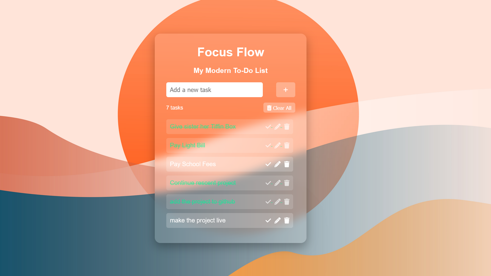

# FocusFlow — Your Personal Workflow Assistant

Modern web app to add, track, and manage tasks efficiently with a sleek, interactive UI.

---

## Description
FocusFlow is a modern, fully-featured web-based productivity app designed to help users manage tasks efficiently. Users can add, edit, complete, and delete tasks, with tasks persisting in the browser through local storage. The app features a **glassmorphism UI**, responsive design, and interactive animations, making it visually appealing and portfolio-ready.

---

## Features
1. Add tasks using input field or Enter key.
2. Edit existing tasks via the edit button.
3. Mark tasks as completed with visual feedback.
4. Delete individual tasks with the delete button.
5. Clear all tasks with a confirmation popup.
6. Tasks persist in browser local storage even after refresh.
7. Responsive design for mobile, tablet, and desktop.
8. Task counter displays the number of current tasks.
9. Interactive UI with hover effects, slide-in animations, and Font Awesome icons.
10. Glassmorphism style with semi-transparent, blurred background card.

---

## Technologies
- HTML  
- CSS (Glassmorphism, responsive layout, animations)  
- JavaScript (DOM manipulation, event handling, local storage)  
- Font Awesome icons

---

## How to Run
1. Clone or download the repository.
2. Open `index.html` in any modern browser.
3. Use the input field to add tasks and press + or Enter.
4. Click check icon to mark tasks complete.
5. Click pencil icon to edit tasks.
6. Click trash icon to delete individual tasks.
7. Click Clear All to remove all tasks with confirmation.
8. Tasks will persist automatically in local storage.

---

## Skills Demonstrated
- Front-end development  
- Interactive UI/UX design  
- Data persistence with local storage  
- Event handling and DOM manipulation  
- Responsive web design  
- Modern web styling (glassmorphism, gradients, animations)
